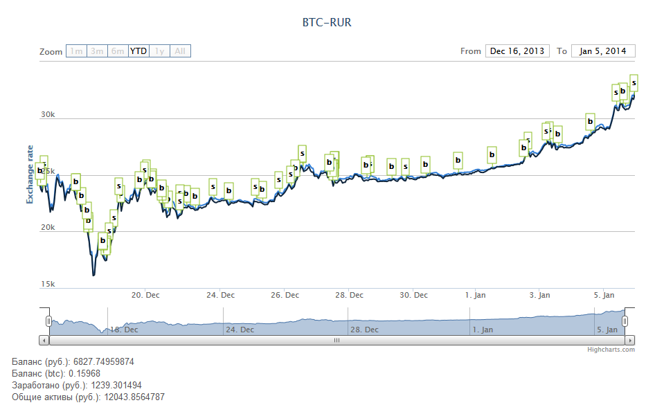

Trading bot for btc-e.com
=========================

This bot can analize stock chart and determine buy and sell moment.
The strategy is buys bitcoins in a grow and sells in a fall. Bitcoins sells only with some profit, if no profit, then bot is waiting and is't selling.
In this version bot works only with btc_rur pair.
Powered by Yii.

Requirements
============
- PHP 5.3
- MySQL 5.5
- Yii 1.14

How to try it?
===============
* Clone repository to your system
* Create database with utf8_general_ci collation
* Go to config/main_local.php, set your database setting for test and develop on local
* Start console and go to /protected/
* Start migration - yiic migrate --interactive=0
* Start bot to demonstrate work on last period - yiic cron test
* Configure virtual hosts to project folder from btcbot.loc
* Go to http://btcbot.loc/index.php?r=site/chart to see result. It's looks like this:

How to start earn money?
=======================
* In protected/components/APIProvider.php set constant isVirtual = false;
* Go to config/main.php, set your database setting for production and btc-e key info (take it in your profile in btc-e.com)
* Publish code to server
* Run migrations
* In the crontab add job which executes every 3 minutes - yiic cron run
* Enjoy
 
WARNING: You can lose all your money, and author doesn't guarantee you anything.
 
 
It's not last version!
=====================
 
In private repo we have enchanced version of this bot and we use it to earn more money $)
If you want to get last version, you can join to our team.
But we have some regulations:
* If you do not contribute a project for a long time, you are kicked out from the project and you have a version of the bot which was last downloaded.
* To join to our team you need to fork this project and make some enchance. We take your in team if it will be a good work.
* 
P.S.: Sorry for bad code and russian comments, in future i'll fix it ;)
